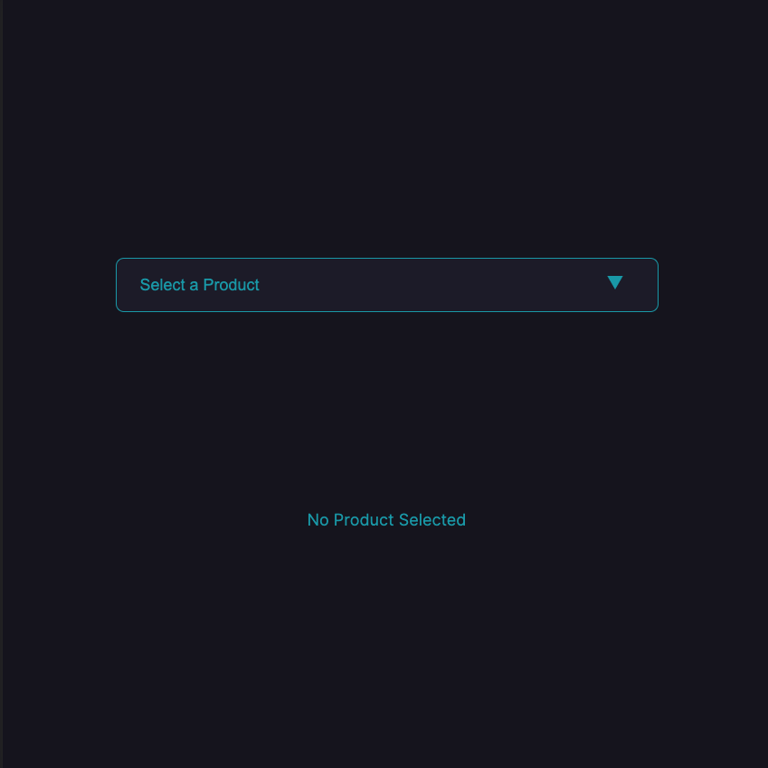
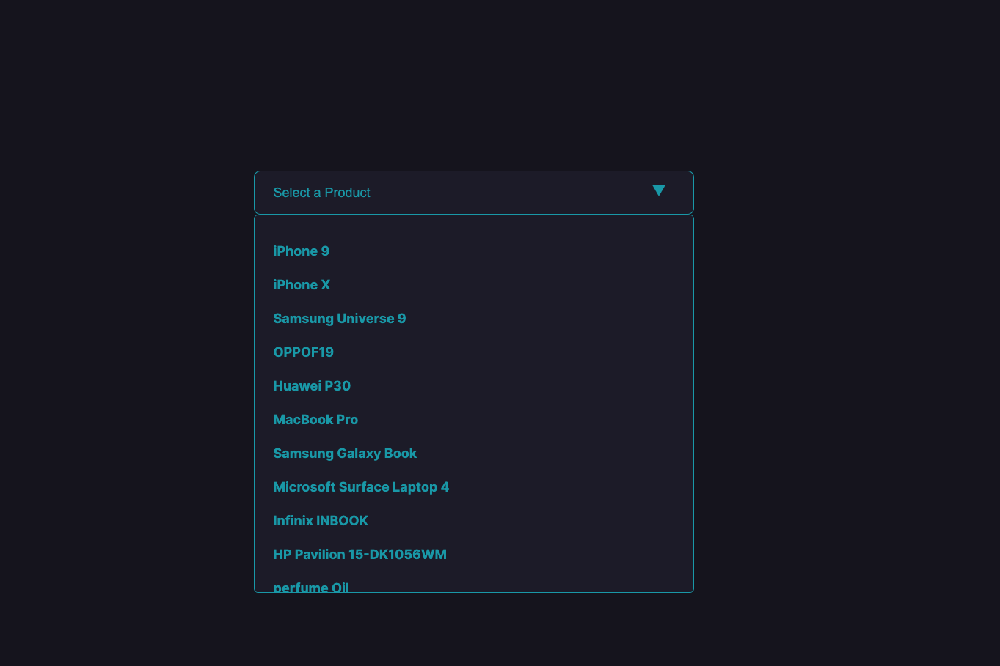
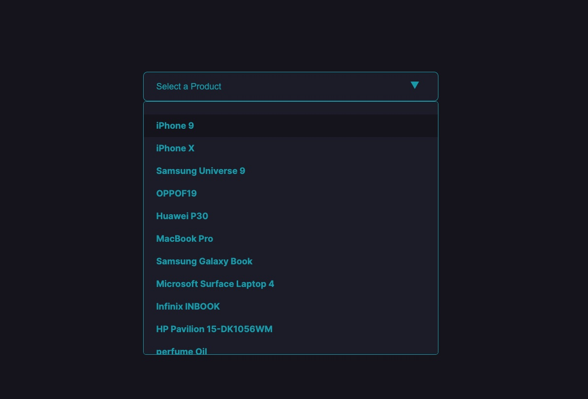
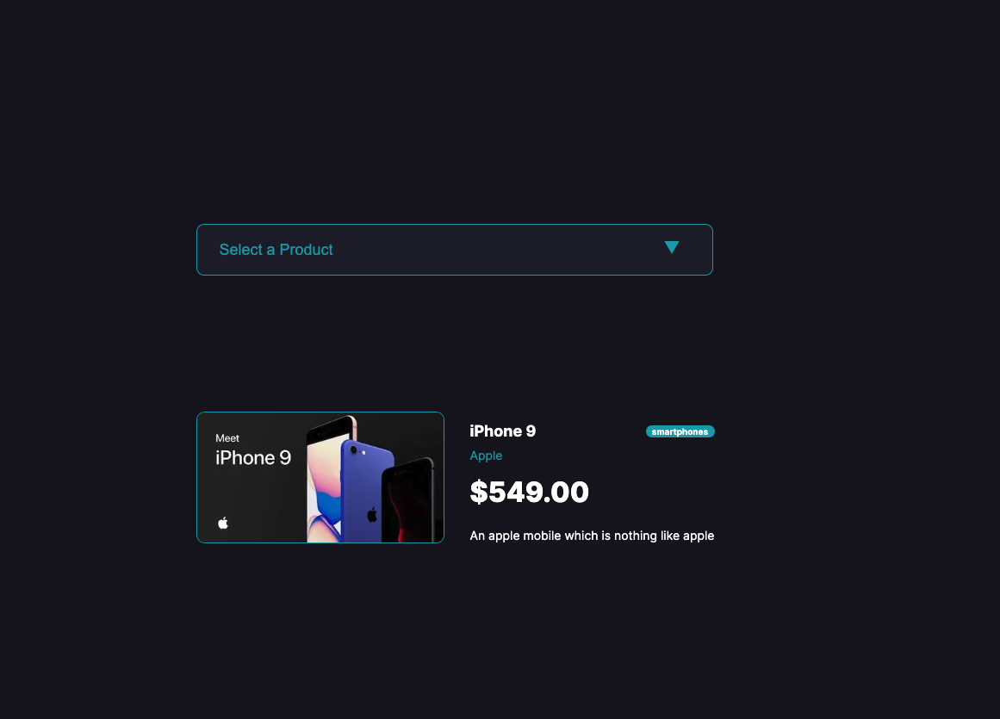
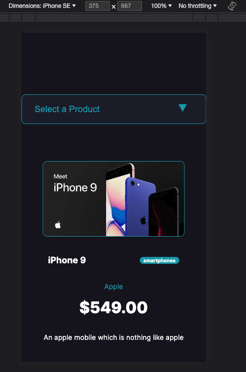
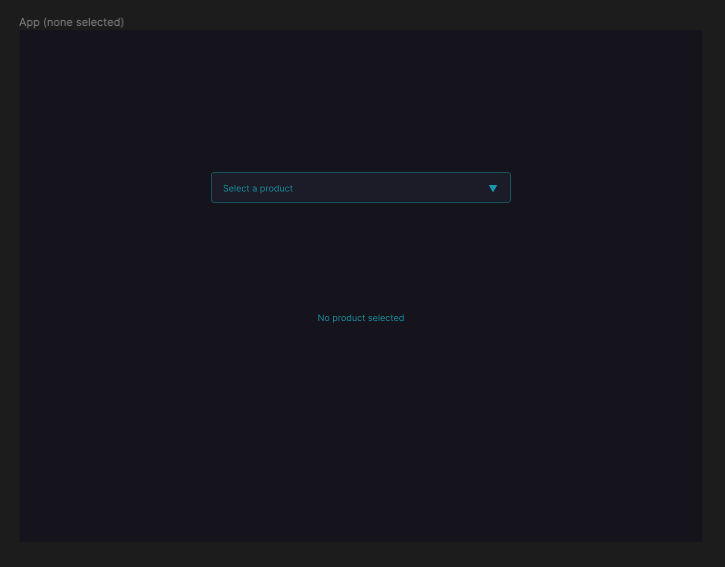
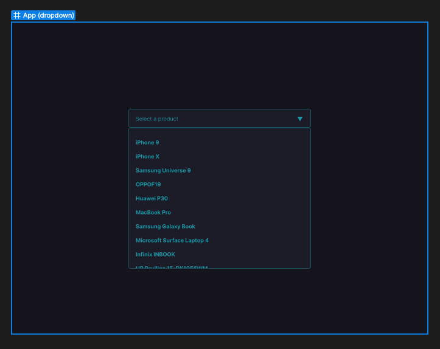
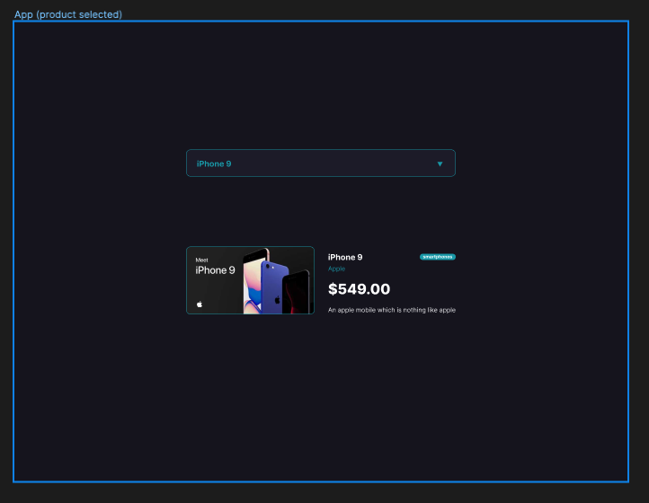

# Product Search


### Deployed via Vercel: 
[https://product-search-334g7be5c-chelsea314.vercel.app/](https://product-search-334g7be5c-chelsea314.vercel.app/) 

## Description
The [Product Search](https://product-search-334g7be5c-chelsea314.vercel.app/) application contains an array of items from which a user can select. Explore different products from categories such as, smartphones, laptops, groceries, fragrances and more! Upon product selection, users are presented with information about the product, including an image, brand name, price and a brief description. 

This is a sample application representing my ability as a web developer to transform a [Figma mockup](https://www.figma.com/file/mWoyEepUuW9un60QzOnpUp/Frontend-Engineer-Take-Home-Assessment?type=design&node-id=1%3A15&mode=design&t=EomlY3pCiMAveAWz-1) into a functional application. 

In addition to the mockup provided, I have developed the applicaiton to be responsive for all screen sizes using CSS media queries.

## Table of Contents
- [Installation](#installation)
- [Usage](#usage) 
- [About](#about)
- [Credits](#credits)
- [Figma Mockups](#figma-mockups)

## Installation

First, clone the Product Search repository. Install the project's dependencies with `npm i`, then run the development server:

```bash
npm run dev
# or
yarn dev
# or
pnpm dev
```

Open [http://localhost:3000](http://localhost:3000) with your browser to see the result.

## Usage
### The starting view presents the user with a dropdown option to select a product. 


### Users are presented with a list of choices to scroll through. 


### Hover effects implemented to improve user experience.


### Users are presented with data about selected products. Data is retrieved from  [dummyJSON](https://dummyjson.com/docs/products).


### Responsive view implemented.


## About
This single page application uses product data from a third-party API, [dummyJSON](https://dummyjson.com/docs/products). 

This is a [Next.js](https://nextjs.org/) project bootstrapped with [`create-next-app`](https://github.com/vercel/next.js/tree/canary/packages/create-next-app).

## Figma Mockups
### No Product Selected View:


### Dropdown View:


### Product Selected View:


## Credits
The Figma mockup was provided by [Diligent Robotics](https://www.diligentrobots.com/) as part of their assessment process. 

[dummyJSON](https://dummyjson.com/docs/products)
